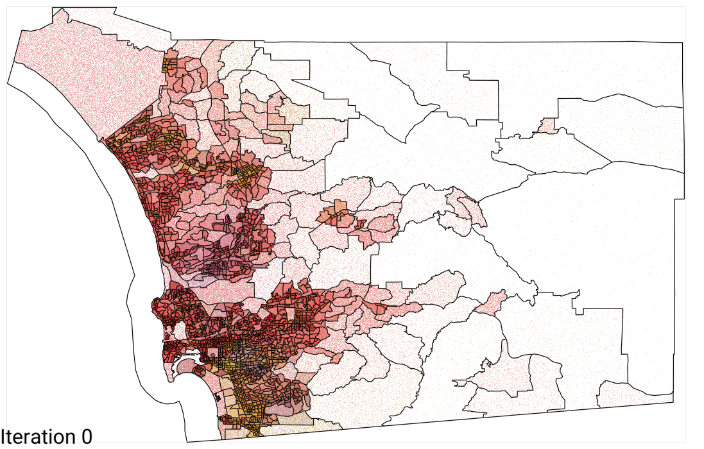

# SchellingSanDiego
This repository contains an algorithm for simulating a Schelling Model in a continuous two-dimensional space, incorporating population count restrictions for each subsection of the map. It also includes an interactive HoloViews plot with dynamic zoom functionality to visualize population movement over time.

